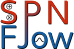

[](https://lbesson.mit-license.org/)
[](https://badge.fury.io/py/spnflow)

# SPNFlow

## Abstract
SPNFlow is a Python library that implements probabilistic models such as various kinds of **Sum-Product Networks**,
**Normalizing Flows** and their possible combinations for tractable probabilistic inference.
Some models are implemented using **PyTorch** for fast training and inference on GPUs.

## Features
- Inference algorithms for SPNs. [1] [2] [4]
- Learning algorithms for SPNs structure. [1] [2] [3] [4]
- Optimization of the structure of SPNs. [4]
- JSON I/O operations for SPNs. [4]
- Implementation of RAT-SPN using PyTorch. [5]
- Implementation of MAFs and Real-NVPs using PyTorch. [6] [7] [8]
- Implementation of Deep Generalized Convolutional SPNs (DGC-SPNs). [9]

## Documentation
The library documentation is hosted using Github Pages at [SPNFlow](https://loreloc.github.io/spnflow/).

## Experiments
The datasets required to run the experiments can be found on [Google Drive](https://drive.google.com/file/d/1J97U1PvEm47L79RCXQAS5AvkU7SPqPH-/view?usp=sharing).
After downloading it, unzip it in `experiments/datasets` to be able to run the experiments.

## Example Snippets

### Sum-Product Networks (SPNs)
Continuous variables density estimation using SPNs.
```python
import numpy as np
from spnflow.structure.leaf import Gaussian
from spnflow.learning.wrappers import learn_estimator
from spnflow.algorithms.inference import log_likelihood

data_train = np.vstack([np.random.normal(4.0, 2.0, (500, 2)), np.random.normal(8.0, 1.0, (500, 2))])
data_test = np.vstack([np.random.normal(4.2, 1.0, (100, 2)), np.random.normal(7.8, 3.0, (100, 2))])
n_samples, n_features = data_train.shape
spn = learn_estimator(data_train, [Gaussian] * n_features, min_rows_slice=64)
print(log_likelihood(spn, data_test).mean())
```
Continuous variables binary classification using SPNs.
```python
import numpy as np
from spnflow.structure.leaf import Gaussian, Bernoulli
from spnflow.learning.wrappers import learn_classifier
from spnflow.algorithms.mpe import mpe

data_train = np.vstack([
    np.hstack([np.random.normal(4.0, 2.0, (500, 2)), np.zeros((500, 1))]),
    np.hstack([np.random.normal(8.0, 1.0, (500, 2)), np.ones((500, 1))]),
])
data_test = np.array([
    (5.0, 4.5, np.nan),
    (7.0, 6.0, np.nan)
])
n_samples, n_features = data_train.shape
distributions = [Gaussian] * (n_features - 1) + [Bernoulli]
spn = learn_classifier(data_train, distributions, min_rows_slice=64)
print(mpe(spn, data_test))
```

## Related Repositories
- [SPFlow](https://github.com/SPFlow/SPFlow)
- [RAT-SPN](https://github.com/cambridge-mlg/RAT-SPN)
- [MAF](https://github.com/gpapamak/maf)
- [LibSPN-Keras](https://github.com/pronobis/libspn-keras)

## References
1. On Theoretical Properties of Sum-Product Networks (Peharz et al.).
2. Sum-Product Networks: A New Deep Architecture (Poon and Domingos).
3. Mixed Sum-Product Networks: A Deep Architecture for Hybrid Domains (Molina, Vergari et al.).
4. SPFLOW : An easy and extensible library for deep probabilistic learning using Sum-Product Networks (Molina, Vergari et al.).
5. Probabilistic Deep Learning using Random Sum-Product Networks (Peharz et al.).
6. Masked Autoregressive Flow for Density Estimation (Papamakarios et al.).
7. Density Estimation using RealNVP (Dinh et al.).
8. Normalizing Flows for Probabilistic Modeling and Inference (Papamakarios, Nalisnick et al.).
9. Deep Generalized Convolutional Sum-Product Networks for Probabilistic Image Representations (Van de Wolfshaar and Pronobis).
